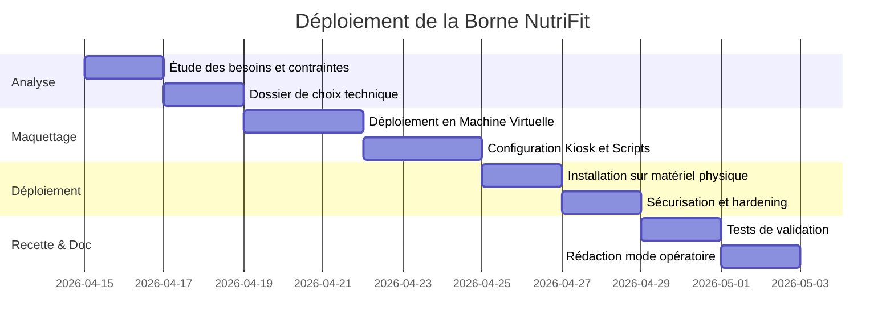

# Réalisation Professionnelle (RP01) - Borne Kiosk NutriFit

> 🌐 **Aperçu Visuel :** Retrouvez une présentation illustrée de ce projet sur mon portfolio : [edib16.github.io/Portfolio/#RP01](https://edib16.github.io/Portfolio/#RP01)

**Auteur :** Edib
**Formation :** BTS SIO (Services Informatiques aux Organisations) - Option SISR
**Date :** Mai 2026

---

## 1. Contexte du Projet

Dans le cadre d'un projet inter-spécialités (SISR/SLAM), l'objectif de cette réalisation est de concevoir, déployer et sécuriser une machine virtuelle Kiosk destinée au service **NutriFit** simulant une borne interactive.

La machine virtuelle Kiosk doit être installée en libre-service dans un environnement public. Elle nécessite donc un haut niveau de sécurité (blocage des accès au système d'exploitation) et de fiabilité (démarrage automatique, restauration facile).

## 2. Sommaire de la Documentation

Ce dépôt GitHub contient l'ensemble de la documentation technique et opérationnelle liée au déploiement de l'infrastructure :

1. [Dossier de Choix Technique](01_DOSSIER_CHOIX_TECHNIQUE.md) : Analyse comparative et justification de la solution Xubuntu + Chromium.
2. [Procédure d'Installation](02_PROCEDURE_INSTALLATION.md) : Guide pas-à-pas pour la configuration de la machine virtuelle.
3. [Mode Opératoire](03_MODE_OPERATOIRE.md) : Manuel utilisateur et procédures de dépannage niveau 1.
4. [Cahier de Recette](04_CAHIER_DE_RECETTE.md) : Tableau de validation des fonctionnalités et de la sécurité.
5. [Dossier Scripts](scripts/) : Code source des scripts d'automatisation et de configuration (Bash, Desktop Entry).

## 3. Compétences BTS SIO (SISR) Mobilisées

Ce projet m'a permis de mettre en œuvre et de valider les compétences suivantes du référentiel BTS SIO :

| Bloc de Compétences | Compétences spécifiques validées dans ce projet | Preuves / Exemples concrets |
|:---|:---|:---|
| **Bloc 1 : Support et mise à disposition de services informatiques** | **Gérer le patrimoine informatique** | Déploiement logiciel de la machine virtuelle (OS Xubuntu). Création de snapshots de restauration. |
| | **Répondre aux incidents et aux demandes d'assistance** | Rédaction du `03_MODE_OPERATOIRE.md` contenant les procédures de dépannage (troubleshooting). |
| | **Travailler en mode projet** | Rédaction de la documentation, élaboration du choix technique, respect des délais (voir Gantt). |
| **Bloc 3 : Cybersécurité des services informatiques** | **Protéger les données à caractère personnel** | Création d'un utilisateur restreint (`nutrifit`) sans droits d'administration. |
| | **Préserver l'identité numérique de l’organisation** | Sécurisation des accès à la machine virtuelle (mode Kiosk strict, désactivation raccourcis, Firewall UFW). |

## 4. Planning de Réalisation (Diagramme de Gantt)

